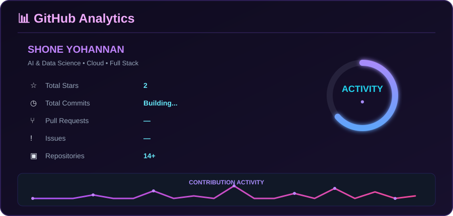

---

## 🖥️ `whoami`

```text
> Initializing ShoneYohannan...

  Name       : Shone Yohannan
  Focus      : AI • Data • Cloud
  Currently  : Building & learning
  Environment: Linux • Git • AWS
  Languages  : Python • JavaScript • Java
  Backend    : Node.js • Express • FastAPI
  Frontend   : React • Vite
  Database   : MongoDB • MySQL
```

## ⚡ What I Build

* 🤖 AI & Machine Learning applications
* ☁️ Cloud-based applications and deployments
* 🌐 Full-stack web applications
* 📊 Data-driven applications
* 🔐 Security-focused projects
* 🚀 Automation and developer tools

## 🛠️ Tech Stack

<p align="center">


</p>

---

## 🚀 Featured Projects

<table>
<tr>
<td width="50%">

### ☁️ CloudPilot

Intelligent cloud application deployment, monitoring and container management platform.

**Tech:** Node.js · Express · MongoDB · AWS

<a href="https://github.com/ShoneYohannan/Cloudpilot">View Project →</a>

</td>

<td width="50%">

### 🧭 Navora

A modern web application built with JavaScript.

**Tech:** JavaScript

<a href="https://github.com/ShoneYohannan/Navora">View Project →</a>

</td>
</tr>

<tr>
<td width="50%">

### 🛡️ CrowdGuard

A crowd-management focused application.

**Tech:** JavaScript

<a href="https://github.com/ShoneYohannan/CrowdGuard">View Project →</a>

</td>

<td width="50%">

### 🧠 Emotion-Aware AI

Real-time facial emotion recognition using Mini-Xception and OpenCV.

**Tech:** Python · OpenCV · Deep Learning

<a href="https://github.com/ShoneYohannan/Emotion-Aware-Ai">View Project →</a>

</td>
</tr>
</table>

---

## 🧪 Other Projects

* 🩺 [AI Doctor Voice Assistant](https://github.com/ShoneYohannan/AI-Doctor-Voice-Assistant)
* 🔐 [Secure Notes Manager](https://github.com/ShoneYohannan/Secure-notes-manager)

---

## 📊 GitHub Analytics

<div align="center">



</div>

</div>


## 🐍 Contribution Snake

<div align="center">


</div>

---

<div align="center">

### `Building • Learning • Experimenting`


</div>
